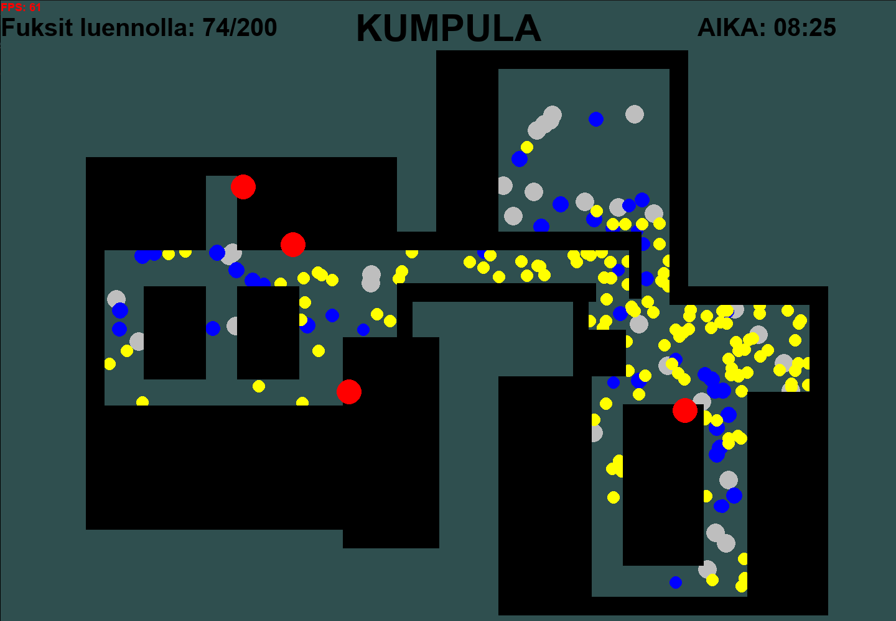

# Fuksi-Simulaattori

Leikkimielinen fuksisimulaattori jossa fuksit yrittävät suunnistaa kumpulan käytävillä luennoille. 
Fuksi on keltainen pallero joka yrittää suunnistaa tavoitteeseensa. Kun simulaattorin eri hahmot törmäävät toisiinsa voivat he kysellä toisiltaan neuvoa kuinka päästä tavoitteeseensa. Mutta kaikkien neuvot eivät aina ole yhtä hyviä.



## Hahmot

### Fuksi
Fuksi on keltainen pallero joka ei tiedä mihin on menossa. Kun fuksi tormää toiseen henkilöön antaa hän suuntaneuvon joka on lähtökohtaisesti väärään suuntaan. Fuksi liikkuu suoraviivaisesti kunnes törmaa seinään tai toiseen henkilöön joka neuvoo hänelle uuden suunnan.

### Opiskelja (1-5)
Opiskelija (1-5) toimii lähes identtisesti kuin fuksi mutta opiskelija antamat suuntaneuvot ovat lähtökohtaisesti oikeaan suuntaan. Sitä suurempi akateeminenikä sitä parempia neuvoja opiskelija antaa. Opiskelijan tunnistaan sinisestä ulkoasustaan.

### Opiskelija (n>5)
Opiskelja(n) liikkuu painotetun (kohti tavoitettaan) kaksi-uloitteisen satunnaiskulun mukaisesti. Heidät voi tunnistaa hapuleivista ja tärisevistä liikkeistä (Luulin että tällainen sekoilu... ja jne.). Jos heiltä kysyy neuvoja antavat he täysin satunnaisen suunnan. 

### Proffa
Proffat liikkuvat hitaasti käytävillä ilman varsinaista tavoitetta. He käyskentelevät käytävillä miettien ja auttavat opiskelijoita löytäämään oikeaan paikkaan. Jos proffalta kysyy neuvoa osoittavat he suoraan kohti paikkaa johon kyselijä on menossa. Proffa on harmaa ja hieman muita suurempi.


## Käyttöohjeet

### Riippuvuudet (Dependencies)

* numpy  (>= 1.21.5)
* pygame (>= 2.1.2)
* python (>= 3.10, uses match statements)

### Ohjelmant ajaminen (Running program)

```bash 
python fuksi-simulaattori.py
```

### komentorivi argumentit (Commandline arguments)

```bash 
usage: fuksi-simulaattori.py [-h] [-m {kumpula,areena}] [-f FUKSI] [-o OPISKELIJA] [-p PROFFA]

options:
  -h, --help            show this help message and exit
  -m {kumpula,areena}, --map {kumpula,areena}
                        Define the map of the simulation
  -f FUKSI, --fuksi FUKSI
                        Number of fuksi
  -o OPISKELIJA, --opiskelija OPISKELIJA
                        number of opiskelija
  -p PROFFA, --proffa PROFFA
                        number of proffa
```

## Kort svensk beskrivning 

Detta är en humoristisk gulis-simulator som visar hur gulisarna försöker navigera till sina föreläsningar på sin första dag på kampuset. På vägen stöter de på olika personer och kan fråga efter direktioner, men alla råd är inte lika bra som andra.

## Brief English description

This is a simple university freshman simulation of their first day at the campus. The yellow freshmen try desperately to find their way to the lectures and ask for directions from the people they meet on the way. The only problem is that the advise they get varies in quality based on the one givin it.


## todos
- GUI options
- Sound?
